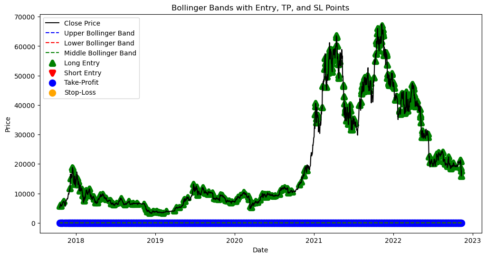

# Kucoin Logistic Regression Trading Strategy

The provided code represents a data-driven approach to cryptocurrency trading strategy development and evaluation. Here's a general explanation of the code:

## Data Loading and Preprocessing
The code loads historical cryptocurrency price data from a CSV file and preprocesses it by removing unnecessary columns. It computes technical indicators such as Bollinger Bands and generates additional features like returns and directional signals.

## Model Training and Prediction
After preprocessing, a logistic regression model is trained using the preprocessed data to predict the directional movement of cryptocurrency prices. Input features for the model include lagged returns and Bollinger Bands derived from historical price data.

## Trading Strategy Implementation
The predicted directional signals from the trained model are used to generate trading signals. These signals are based on specific conditions derived from Bollinger Bands. The strategy determines entry points for long and short trades and dynamically sets target profit (TP) and stop-loss (SL) levels based on Bollinger Bands.

## Evaluation of Trade Performance
The effectiveness of the trading strategy is evaluated through backtesting on historical data. Various performance metrics, including total trades, profitable trades, total profit, average profit per trade, maximum drawdown, and profit factor, are calculated. The code also provides visualizations of entry, TP, and SL points on a price chart.

## Model Persistence
Finally, the trained logistic regression model is serialized and saved to a pickle file for future use. The code includes functionality to load the saved model to ensure its integrity and usability for further analysis or deployment.



Next step the code defines a class called `MLTrader` that implements a machine learning-based cryptocurrency trading strategy. 

### Connecting Kucoin Exchange with Machine Learning-Based Trading Strategy

#### Imports
The code imports essential libraries including pandas, numpy, ccxt for cryptocurrency exchange access, scikit-learn for logistic regression modeling, and utilities for logging and time handling.

```python
import pandas as pd
import os
import numpy as np
from sklearn.linear_model import LogisticRegression
import ccxt
from datetime import datetime, timedelta
import time
import pickle
import logging 
from pytz import UTC
import talib
```

#### MLTrader Class
The `MLTrader` class implements a machine learning-based cryptocurrency trading strategy.

#### Initialization
The constructor `__init__` initializes the trader with parameters such as trading instrument, lag period for features, model path, trading units, and leverage. It also sets up the cryptocurrency exchange object using the ccxt library with provided API credentials.

```python
class MLTrader:
    def __init__(self, instrument, lags, model_path, units, leverage):
        # Initialization code here
```

#### Model Loading
The `load_model` method loads a pre-trained machine learning model from a specified path using pickle.

```python
    def load_model(self, model_path):
        # Load model from the specified path
```

#### Data Retrieval
The `get_most_recent` method fetches historical OHLCV data (open, high, low, close, volume) for a specified number of days from the exchange API. It continuously fetches data until the specified stop condition is met.

```python
    def get_most_recent(self, days=5, data_count=0, stop_condition=200):
        # Fetch historical OHLCV data
```

#### Strategy Definition
The `define_strategy` method defines the trading strategy based on the fetched data and the loaded machine learning model. It preprocesses the data, generates lag features, computes technical indicators like Bollinger Bands, and makes predictions using the model.

```python
    def define_strategy(self):
        # Define trading strategy based on fetched data and loaded model
```

#### Execution of Trades
The `execute_trades` method executes trades based on the defined strategy. It determines the trading signal (long, short, or neutral) based on the predicted position from the model and executes corresponding buy or sell orders on the exchange.

```python
    def execute_trades(self):
        # Execute trades based on defined strategy
```

#### Main Loop
The main loop continuously fetches historical data, defines the trading strategy, executes trades, and repeats the process after a specified time interval. It also handles closing any open positions before executing new trades based on the updated strategy.

```python
# Main loop for trading strategy execution
while num_iterations is None or num_iterations > 0:
    # Main loop code here
```

### Proposed Visualization for README.md

You can include visualizations of key performance metrics such as profit/loss over time, trading signals, or Bollinger Bands. Here's an example:


This visualization shows trading signals generated by the trading strategy based on historical data. Green arrows represent long (buy) signals, red arrows represent short (sell) signals, and yellow arrows represent neutral signals.

This code provides a framework for implementing and executing a machine learning-based trading strategy in the cryptocurrency market. It demonstrates the integration of data retrieval, model loading, strategy definition, and trade execution functionalities.

#### Disclaimer
Please note that cryptocurrency trading involves significant risk, and past performance is not indicative of future results. This code is provided for educational and informational purposes only. Always conduct thorough research and consult with a financial advisor before making any investment decisions.
